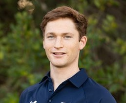

# Stuart Boynton
##### UCSD 2022

### Education
I first learnt to code at **Bishops Diocesan College** high school in Cape Town, South Africa. I am currently studying computer engineering at **The University of California San Diego** where I am a senior. I plan to continue my studies and do a masters next year.

### About Me
My favourite quote is
> You Only Live Once

My favourite line of code is `print("Hello World")`.

My favourite website is [Facebook](https://www.facebook.com)

My goals are 
- Pass this class
- Graduate
- Do something useful with my life
  
Tasks I have completed for this class
- [x] Lab 1
- [ ] Lab 2
- [ ] Lab 3
- [ ] ...

The order of my favourite Formula 1 teams is,
1. Mclaren
2. Alpine
3. Red Bull

If you want to go back to my education section click here [Education](#education)

You can find the README file [here](README.md)

